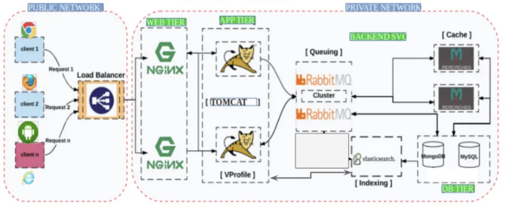

# Vprofile-Project-Multi-Tier-Web-Application-Stack-Setup-Locally #

This guide aims to help you create a Three-Tier Architecture on your local machine. 

This architecture comprises three layers: the Web Server Tier, the Java-based Application Tier,and the MySQL RDS Database Tier .

The design image below illustrates the three tiers of the application architecture:

We would need to provision 6 vms for the following services 

1. Nginx: Web Service (ubuntu)
2. Tomcat: Application Server  (ubuntu)
3. RabbitMQ: Broker/Queuing Agent (ubuntu)
4. Memcache: DB Caching (ubuntu)
5. ElasticSearch: Indexing/Search service (CentOS)
6. MySQL: SQL Database (CentOs)
